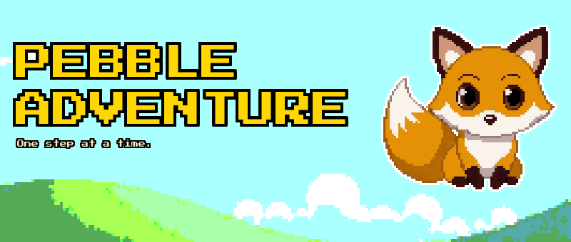
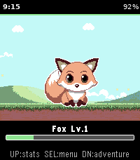
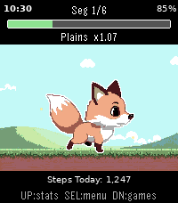
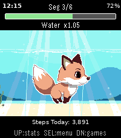
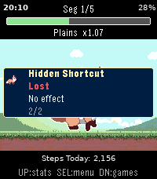
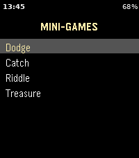
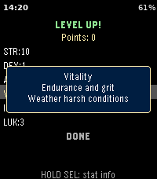
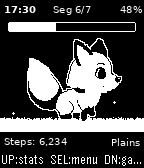
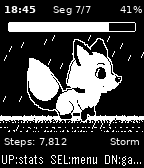
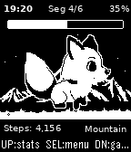

# Pebble Adventure

## Walk further. Level up. Explore the world. One step at a time.

---

## The Game

Born from a love of Chao Adventure, Tamagotchi, and Ragnarok Online, Pebble Adventure is a pocket pet game
that turns your daily steps into a living adventure. Your pet companion explores a pixel-art world of biomes 
powered entirely by how much you walk.

The pet is always with you. A background worker tracks your steps around the clock, advancing your journey
without ever opening the game. When you miss your pet and open the game, you will see how your pet has progressed. 
Encounters, biome crossings, even an adventure completion; the world continued, and now you can pick up with it.

Every level-up awards stat points you allocate freely: invest in Strength and Agility to cover ground faster,
or build Intellect and Luck to tip encounters in your favor. Stats compound over time, and each choice shapes
the adventure ahead.

Each biome has its own mechanical identity: Plains reward the steady walker, Caves favor the clever, Storms
test pure resilience; each is fresh and difficulty scales as you push deeper. Between segments, optional minigames keep
things tactile and can directly effect the progress of your adventure.

Pebble Adventure supports both the **Pebble Time 2** (emery) and **Pebble 2 Duo** (flint) Pebble platforms,
with hand-crafted pixel-art backgrounds for each display.

---

## Features

- **Cute pet**: A cute pixel pet that grows with you; step by step.
- **Biomes**: Beautiful pixel backgrounds, each with unique mechanics and graphical effects
- **Passive step-driven progress**: background worker advances adventures without opening the app
- **Encounters**: Random encounters effect adventure progress, even when the app the closed
- **Minigames**: Play games with your pet to pass the time and speed up your adventure
- **Stats**: Freely allocated stat points allow you to add a personality to your pet
- **XP & leveling**: Scaling XP based on multiple factors enables a full experience and level system for your pet
- **Dual-platform**: full color on Pebble Time 2, crisp B&W on Pebble 2 Duo; each optimized independently

---

## Screenshots

<table>
  <tr>
    <td></td>
    <td></td>
    <td></td>
  </tr>
  <tr>
    <td></td>
    <td></td>
    <td></td>
  </tr>
  <tr>
    <td></td>
    <td></td>
    <td></td>
  </tr>
</table>

---

## Dev Setup

**Prerequisites**

- [Pebble SDK 3](https://developer.rebble.io/developer.pebble.com/sdk/index.html)
- Node.js (for tools in `tools/`)

**Build & run**

```bash
git clone https://github.com/levonn-dev/pebble-adventure.git
cd pebble-adventure
pebble build
```

Install on emulator:

```bash
pebble install --emulator emery   # full color (Pebble 2)
pebble install --emulator flint   # B&W (Pebble 2 Duo)
```

Stream logs:

```bash
pebble logs
```

---

## Adding Features

### New biome

1. Add a `BiomeDef` entry to `s_biomes[]` in `src/c/game_state.c`: set name, segment count range,
   difficulty, and the two stats used for step cost.
2. Add color and B&W background images under `resources/images/backgrounds/color/` and `…/bw/`.
3. Register both in `package.json` under `resources.media`.
4. Load the new background in `src/c/backgrounds.c`, following the existing `switch` on biome type.

### New encounter

1. Add an `EncounterDef` entry to the encounter array in `src/c/events.c`.
2. Increment `NUM_ENCOUNTERS` in `src/c/events.h`.
3. Set the `stat_a`/`stat_b` fields and the success/failure XP and progress deltas.
4. The generic stat-check logic in `events.c` handles resolution with no new code path needed unless
   you want custom behavior.

### New minigame

1. Create `src/c/minigames/minigame_<name>.c`. Implement `push_minigame_<name>_window()` and the
   corresponding pop/result callback, following the pattern in `minigame_dodge.c`.
2. Add the menu entry to `s_minigame_items[]` in `minigame_menu.c` and wire the selection callback.
3. The existing window stack push/pop pattern handles cleanup with no extra registration needed.

---

## License

Pebble Adventure uses a split license:

- **Code** (everything under `src/`, `worker_src/`, `tools/`, plus build files) is licensed under
  the **GNU General Public License v3.0**. See [`LICENSE`](LICENSE).
- **Art and other creative assets** (everything under `resources/`, `screenshots/`, and `docs/`) is
  licensed under **Creative Commons Attribution-NonCommercial-ShareAlike 4.0 International**
  (CC BY-NC-SA 4.0). See [`LICENSE-ASSETS`](LICENSE-ASSETS).

In short: you're welcome to fork, learn from, and build on the code under GPL-3.0 terms, but the
pixel art and screenshots may not be used in commercial works without permission.
